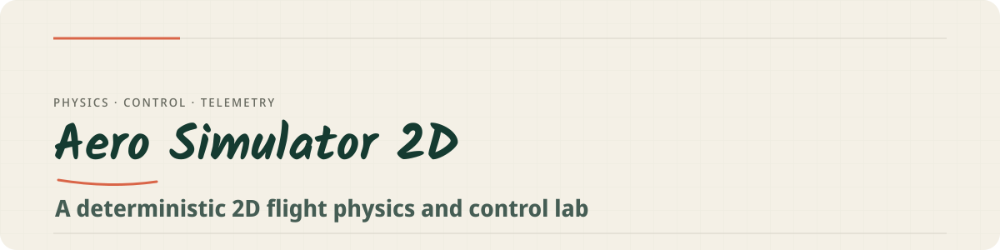

  

  
  
  
  

# Aero Simulator 2D

A deterministic, real-time 2D physics simulator and control laboratory written in Python. The project simulates multirotor UAV flight dynamics under external forces using a custom Runge-Kutta 4th order (RK4) integrator and cascaded PID (Proportional-Integral-Derivative) controllers. It works as a testbed for control logic against realistic 2D constraints — aerodynamic drag, gravity, and wind shear.

## Why it is technically interesting

- **Custom RK4 integrator at 200 Hz** — every body must provide a state vector, a `.dynamics()` derivative, and `.apply_constraints()`; the loop stays agnostic.
- **Cascaded PID control** — outer position loop → pitch/thrust mapping → inner attitude PID → motor mixer with smart saturation that re-allocates torque when a motor hits zero RPM.
- **Scripted disturbance timeline** — an event timeline drives a gale-force wind, a microburst, and a figure-8 tracking phase to validate robustness.

## Architecture Overview

The system architecture cleanly separates the physics simulation from the control logic.

### 1. The Physics Engine (The Black Box)
The integration step is handled by a stateless Runge-Kutta 4th Order (`RK4Integrator`). For the scope of this laboratory, the integrator is treated as an abstract black box. It requires any simulation body to conform to a strict contract:
* Provide a continuous state vector.
* Provide a `.dynamics(state, inputs, ext_force)` method that returns the state derivative.
* Provide an `.apply_constraints()` method for hard limits (e.g., ground collision).

The integrator runs at a fixed 200 Hz simulation rate.

### 2. Physical Models

#### Birotor Dynamics
The Birotor model calculates thrust and torque based on motor RPM (Revolutions Per Minute). The core equations governing the translational and rotational accelerations are:

$$T = k_f (\omega_1^2 + \omega_2^2)$$
$$\tau = L k_f (\omega_1^2 - \omega_2^2) - c_\theta \dot{\theta}$$
$$m \ddot{x} = T \sin(\theta) + F_{ext,x} - c_x \dot{x}$$
$$m \ddot{z} = T \cos(\theta) + F_{ext,z} - mg - c_z \dot{z}$$

Where:
* $T$ is total thrust, $\tau$ is net torque.
* $k_f$ is the motor thrust coefficient (calibrated to **3.92e-7 N/RPM²**).
* $L$ is the moment arm length.
* $c$ values represent aerodynamic drag coefficients.

#### Monocopter Dynamics
A simplified 1-DOF (Degree of Freedom) vertical copter used for isolated altitude-hold testing.

### 3. Control Systems (Deep Dive)

The `BirotorController` implements a cascaded PID loop with smart motor mixing and saturation control.

1.  **Outer Loop (Position):** Calculates the desired horizontal ($F_x$) and vertical ($F_z$) forces needed to reach the target coordinates.
2.  **Geometric Mapping:** Converts the required force vectors into a target pitch angle ($\theta_{dest}$) and a total thrust command. Guardrails prevent mathematical singularities at a 90° pitch.
3.  **Inner Loop (Attitude):** A fast-acting PID loop calculates the torque required to reach $\theta_{dest}$.
4.  **Motor Mixer:** Solves the linear system to distribute thrust and torque demands into squared RPM commands for the left and right motors:
    * $\omega_{1}^2 = \frac{T_{dest}}{2k_f} + \frac{\tau_{dest}}{2Lk_f}$
    * $\omega_{2}^2 = \frac{T_{dest}}{2k_f} - \frac{\tau_{dest}}{2Lk_f}$

---

MIT License · Built by <a href="https://github.com/IBoutbaoucht">Imad Boutbaoucht</a>

